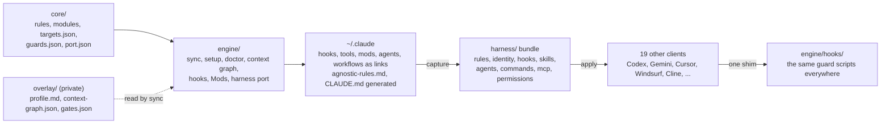

# Agnostic AI

[](https://github.com/ucsandman/Agnostic-AI/actions/workflows/ci.yml)
[](LICENSE)
[](package.json)
[](package.json)
[](docs/targets.md)
[](docs/windows-gotchas.md)
[](https://github.com/sponsors/ucsandman)

**One harness. Every client. One repository.**

Agnostic AI is the operating system for an AI coding harness: the guard hooks
that block secrets and destructive commands, the working agreement (rules), the
on-demand context modules, subagents, saved workflows, Mods (function-hook
plugins), operator tools, scheduled jobs and the learning loop that turns
incidents into rules. It is installed into the client you use (Claude Code) as
links, and ported from there into every other client on the machine (Codex,
Gemini CLI, Cursor and sixteen more) in each one's dialect. Your identity,
private rules, memory and machine config stay in a small private overlay of
your own.

It is not a starter kit designed in an afternoon. It grew rule by rule out of
daily use, and most of it exists because something broke first: every guard
has an incident behind it, every doc has a word ceiling, every check reports
the count it processed, and a check that was never seen failing does not count
as verified.

> This repository is also published as
> [ucsandman/claude-harness](https://github.com/ucsandman/claude-harness), the
> name it was first shared under. Both receive every push; they are the same
> commits.

## Contents

- [Install](#install)
- [What is inside](#what-is-inside)
- [How it fits together](#how-it-fits-together)
- [Guards](#guards)
- [Rules and context modules](#rules-and-context-modules)
- [Mods](#mods)
- [Subagents and workflows](#subagents-and-workflows)
- [Tools](#tools)
- [Scheduled jobs and the learning loop](#scheduled-jobs-and-the-learning-loop)
- [Porting to twenty clients](#porting-to-twenty-clients)
- [Health checks](#health-checks)
- [What is shared, what stays private](#what-is-shared-what-stays-private)
- [Commands](#commands)
- [Documentation](#documentation)
- [Repository layout](#repository-layout)
- [Development](#development)
- [Security](#security)
- [Related](#related)
- [License](#license)

## Install

```sh
git clone https://github.com/ucsandman/Agnostic-AI.git && cd Agnostic-AI
npm run setup      # wire the core guards, link the surfaces, assemble CLAUDE.md, port, doctor
```

Node 18+ and git, nothing else. `setup` compiles `core/rules` into
`~/.claude/agnostic-rules.md`, generates a `CLAUDE.md` that imports it, wires
the core guards into `settings.json`, links `~/.claude/{hooks,tools,mods,agents,workflows}`
into this checkout (a real directory there is moved aside, never deleted),
ports the harness to every other installed client and runs the doctor
(`CLAUDE_CONFIG_DIR` moves the home). The three commands you keep using:

```sh
npm run sync       # rules changed, or a link is missing: recompile, relink, reassemble CLAUDE.md
npm run port       # push the harness to every other installed client
npm run doctor     # drift, a second writer, a broken link, an old path, a private path in public code
```

To use it as a template: click **Use this template**, clone, `npm run setup`.
`core/port.json` chooses the source client, restricts targets, or excludes a
hook, skill or MCP server with a reason.

## What is inside

| Directory | What it holds | Size |
|---|---|---|
| `core/` | The source of truth: `rules/global-rules.md` and its on-demand modules, `templates/targets.json` (the client registry), `safety/guards.json` (the one safety policy), `traits/`, `port.json`, incident `examples/` | 7 modules, 20 clients |
| `engine/` | The port engine and everything that runs: `harness/` (capture, apply, status), `sync/` (rules compiler, link binder, `CLAUDE.md` assembly), `setup/` (first run, links), `doctor/`, `context/` (the module graph), `hooks/` (the guards, their probes, the client shim), `mods/`, `harvest/` and `distill/` (the learning loop), `ingest/`, `skills/`, `audit/`, `docs/` (generators), `tests/` | 14 subsystems, 39 hooks |
| `agents/` | Subagent definitions with model, tools and scope | 6 |
| `workflows/` | Saved Workflow scripts for multi-agent work | 4 |
| `tools/` | Operator CLIs and pages: measure, search, prove, render | 25 |
| `jobs/` | Scheduled jobs and the installer that points Task Scheduler at them | 6 |
| `skills/` | The consolidated skill library, linked (never copied) into each client | 216 |
| `packages/` | `markdown-agent-memory`, the published memory policy, templates and linter | 1 |
| `docs/` | The documentation, each file under a word ceiling the pre-commit hook enforces | 29 |
| `labs/` | Research: the Mods sprint record, detached builder, process ledger, token-flow audit. Nothing in `engine/` depends on it | 4 |
| `examples/` | An installed harness for reference | 1 |
| `harness/`, `storage/` | Your captured bundle and runtime state, both gitignored | |

## How it fits together

Dependency direction is one way: `core` to `engine` to the installed surfaces
to the client homes. The overlay is read through three named files. Every
generated file has one writer, and the doctor fails on a second one.



1. **Capture** reads the client you use into a client-neutral bundle: rules
   with every `@import` inlined, hooks in one dialect, skills, agents,
   commands, MCP servers, permissions. A value that looks like a token becomes
   `${NAME}` and you are told what to export.
2. **Apply** renders the bundle into each other client's dialect. Hooks are
   not copied: every client is pointed at the same scripts through a
   [shim](docs/porting.md#hooks-one-dialect-one-shim); skills are linked.
3. **Nothing is destroyed.** Generated files carry the port's header;
   user-owned files get a marked region and are otherwise preserved. Every
   overwrite is backed up. `--check` exits 1 on drift.
4. **Every drop is explained** by `npm run explain`, from `core/port.json`.

The three places in full, with the storage layout and the adapter contract:
[docs/architecture.md](docs/architecture.md).

## Guards

`engine/hooks/` holds 41 hooks: 38 Node, 2 Python, 1 PowerShell. They run on
Claude Code's events (PreToolUse, PostToolUse, UserPromptSubmit, Stop,
SessionStart, SubagentStart, PreCompact) and, through `engine/hooks/shim.cjs`,
on every other client that has hooks. One file, `core/safety/guards.json`, is
the policy every guard reads: secret paths are always blocked, hard-stop
commands need a human, a missing policy fails closed.

| Group | Hooks | What they do |
|---|---|---|
| Secrets | `secret-guard`, `secret-path-guard`, `tool-output-secret-watch`, `output-secret-watch` | Deny reads and writes of secret files, redact secret-looking values in tool output and in what is displayed |
| Destructive commands | `rm-guard`, `process-kill-guard`, `git-tree-guard`, `dev-server-guard`, `slow-command-guard`, `slopsquat-guard`, `security-tier-check` | Recursive deletes outside scratch need a marker, kills are by PID not by name, no recursive search from a drive root, package names that look hallucinated are refused |
| Model routing and cost | `agent-model-guard`, `capability-graph-guard`, `subagent-budget-guard`, `fable-delegate-guard`, `batch-guard`, `repeat-tool-guard` | Every spawn names a model and flows down the capability graph; fan-outs declare a ceiling; a run of single-statement calls or an identical repeated call is denied |
| Scope and integrity | `scope-lock`, `gate-freeze`, `guard-canary.ps1`, `mods-liveness`, `forced-verify-stop-gate` | Edits stay inside the claimed scope, frozen guard files match their lock, the guards are proven alive at session start, the Mods heartbeat is checked, a turn cannot end without its verification |
| Prompt chain | `prompt-dispatch`, `wakeup-guard` | The ONE UserPromptSubmit process: runs every prompt hook in-process and merges their answers (eight spawns per prompt timed out on a loaded machine); a session woken three times in a row by a Monitor or task notification is told to stop answering "Waiting." and stop the stalled task |
| Context | `context-graph`, `declick-nudge`, `opus-handoff-inject`, `context-nudge`, `codex-memory-inject` | Load the modules the prompt, file or command calls for, under a token budget, with the reason attached |
| Session state | `session-count`, `creds-resolve`, `correction-tracker`, `precompact-extract`, `compaction-ledger`, `post-edit-diagnostics`, `skill-telemetry.py`, `sync-main-checkout.py` | Count live sessions, fill `.env` from the local vault, record corrections, carry state across compaction, syntax-check edited files, record skill use |
| Governance | `dashclaw-guard`, `dashclaw-setup` | Optional: hold risky calls for remote approval in [DashClaw](https://github.com/ucsandman/DashClaw) |
| Client adapters | `adapters/codex-rewrite`, `adapters/codex-delegate-guard`, `universal-adapter` | Translate Codex payloads to the Claude dialect and back; declare what each client's runtime can do |

Every guard has an override marker for the case it was not written for, and a
probe under `engine/hooks/tests/` that makes it fail on purpose. The roster
with markers: [docs/guards.md](docs/guards.md). Measured cost per event:
[docs/hook-latency.md](docs/hook-latency.md).

## Rules and context modules

`core/rules/global-rules.md` is the working agreement every client receives:
non-negotiables (secrets, hard stops), how to work, communication, definition
of done, memory. `npm run sync` compiles it (with `core/traits/traits.md`) into
the primary client's rules file; `npm run port` carries it everywhere.

Situational text is a module, not standing prompt. A module is a markdown file
with a `context:` block (keyword, path and command triggers; `requires` and
`suggests` edges) that loads when the prompt, the edited file or the command
says it applies, in dependency order, under a budget, with the reason attached.

| Module | Loads when |
|---|---|
| `delegation-and-model-routing` | An agent is about to be spawned: the model ladder, escalations, fan-out arithmetic |
| `memory-writing-rules` | A prompt or a write touches memory: provenance tags, the recurrence gate, supersession |
| `secrets-non-negotiable` | A command or edit names an env file, a key or a token |
| `harness-integrity` | A hook or `settings.json` changes: probe, freeze, docs, doctor green |
| `parallel-agents-inbox` | Another agent shares the repository or the inbox holds a claim |
| `harness-push-destinations` | A commit is about to leave: which repository, which mirror |
| `seo-floor` | A public web surface is created |

How the graph selects, resolves and packs: [docs/context-graph.md](docs/context-graph.md).
Your own section of `CLAUDE.md` comes from `overlay/profile.md` and never
enters this repository.

## Mods

`engine/mods/` holds the function-hook plugins that run inside Claude Code's
hooks engine with no process spawn: `claude-runtime` (the runtime adapter:
events, judgments, snapshots) and `harness-mods` (routing, context nudges,
secret redaction, subagent accounting, a read cache). `canary.cjs` and
`shadow-report.cjs` verify them from a classic hook, and
`universal-adapter.cjs` records which of these capabilities each other client
has, so a port drops a Mods-only artefact with a reason instead of pretending.
The research record behind them is `labs/claude-mods/`.

## Subagents and workflows

| Agent | Model | Role |
|---|---|---|
| `haiku-scout` | haiku | Mechanical lookups: file and symbol hunts, inventories, git history; cites file and line |
| `sonnet-implementer` | sonnet | A feature slice or refactor within a given scope; never edits test files |
| `opus-owner` | opus | A large or risky task end to end; may delegate to the two above |
| `e2e-verifier` | sonnet | Runs the verify command for a change someone else made; reports, never fixes |
| `security-reviewer` | opus | Read-only review of auth, billing, secrets, webhooks and database changes |
| `advisor` | one rung above the caller | One focused decision when an architecture choice or a second failed fix needs a stronger model |

| Workflow | Shape |
|---|---|
| `adversarial-review` | Read-only finders per dimension, then a skeptic per finding that defaults to refuted |
| `fix-findings` | Apply confirmed findings in disjoint ownership groups, review each fix, re-fix once, verify, converge |
| `tournament` | N angled candidates, a judge panel scoring five criteria, one synthesized spec from the winner plus grafts |
| `understand` | Parallel readers over named subsystems, one synthesized map answering a question |

Every spawn names its model and every fan-out declares its ceiling; the guards
enforce it. The contract: `core/rules/modules/delegation-and-model-routing.md`.

## Tools

Zero-dependency Node and PowerShell, each in its own directory with a README
or a header that says what it does.

| Tool | What it answers |
|---|---|
| `hook-latency` | Why a session is slow or token-hungry: wall clock per event, per hook, fixed context and cache losses per transcript, RAM and spawn latency |
| `bash-noprofile` | A Git Bash shim for Claude Code's Bash tool on Windows that skips the login profile (a tool call went from 31.6 s to 4.2 s on the machine that motivated it) |
| `spend` | Tokens and estimated dollars per day, model and session, from local transcripts, with rolling windows |
| `fleet` | Which sessions are active, what each is working on, how heavy each is |
| `recall` | One search across project memory, decision docs and the archive |
| `memstale` | Every absolute path a memory mentions still exists |
| `memory-lint` | Machine checks for markdown memory stores, run by the pre-commit hook |
| `skillfind` | Find any skill on the machine, including the invisible ones (stale plugins, project-scoped, disabled versions) |
| `skill-telemetry` | Skill usage over time, from transcripts and the Stop hook |
| `gates` | The mechanical doc checks: word budgets, markdown links, the reference ratchet, note format, rule expiry, the guard freeze |
| `prove` | Breaks the thing a check watches, confirms the check goes red, restores it, confirms green |
| `wiredark` | Catches a new export with no production caller before it is committed |
| `task-contract` | Validates a `TASK_CONTRACT.md` and can discharge every test-tier check |
| `envdoctor` | Secrets and env wiring by name and presence only, never values |
| `gitradar` | Every git repository on the machine: dirty, unpushed, gone branches, last commit age |
| `cronwatch` | A health board for scheduled jobs that fail silently overnight |
| `harness-health` | Every settings layer scanned, every hook command optionally probed once |
| `sync` | The parity matrix per client and component, with check and port-now buttons |
| `dashboard` | The command center: rules, skills, decisions, the error explorer, maintenance routines, in a browser |
| `errorlog` | Two daily logs: what the agent predicted wrong, and what the human got wrong |
| `subagent-budget` | Fits the subagent cost constants to measured transcripts |
| `deskclaw` | A Windows desktop eye and hand: UI trees, screenshots, click, type, key, with redaction and denylists |
| `agent-browser` | Detects and clears a wedged browser daemon |
| `ears` | Local transcription, loudness and silence, waveform and spectrogram |
| `mouth` | Short spoken status lines through Windows text-to-speech |

## Scheduled jobs and the learning loop

`jobs/install.cjs --apply` points Windows Task Scheduler at this checkout. The
jobs are the harness's memory of its own mistakes:

| Job | When | What |
|---|---|---|
| `errorlog/harvest.sh` | 06:22 daily | Extracts deviations and wrong assumptions from the day's transcripts |
| `meditation/run-nightly.sh` | 06:40 daily | A headless session runs the reflection skill over the fresh error log with no credentials in its environment; a stronger model on Sundays for the weekly synthesis |
| `daily-distill.ps1` | nightly | `engine/distill` clusters the errors, evaluates candidate rules on a promotion ladder (observation, fact, rule, trait) and writes a proposal for a human to accept in the dashboard |
| `port-daily.ps1` | after the meditation | Captures the primary client and ports it, so every client wakes up with the promoted rules |
| `reapers/` | periodic | Kill orphaned agent processes and orphaned language servers |

`engine/harvest` feeds `storage/candidates.jsonl`; `engine/distill` promotes
on evidence (three signals across two sessions, older signals counting half,
a contradiction demoting); `tools/dashboard` is where a human approves. The
same ladder produced most of the rules in `core/rules/global-rules.md`.

## Porting to twenty clients

| Component | From (Claude Code) | To Codex CLI | To Gemini CLI | To Cursor | To 16 others |
|---|---|---|---|---|---|
| Rules (`CLAUDE.md`, imports inlined) | ✓ | `AGENTS.md` | `GEMINI.md` | `rules/*.mdc` | each client's rules file |
| Identity (`SOUL.md`) | ✓ | inlined | inlined | inlined | inlined or traits file |
| Hooks (`settings.json`) | ✓ | `config.toml`, pre-trusted | `settings.json` via shim | `hooks.json` via shim | where the client has hooks |
| Skills (`skills/*/SKILL.md`) | ✓ | linked | linked | linked | linked |
| Subagents (`agents/*.md`) | ✓ | `agents/*.toml`, model ladder mapped | – | `agents/*.md` | where supported |
| Slash commands (`commands/*.md`) | ✓ | `prompts/*.md` | `commands/*.toml` | `commands/*.md` | where supported |
| MCP servers (`.claude.json`) | ✓ | `[mcp_servers]` | `mcpServers` | `mcp.json` | where supported |
| Permissions | ✓ | `rules/*.rules` | – | – | – |

Codex CLI works as the source too: the same eight components are read back
from `~/.codex` and written into Claude Code and the rest. The live matrix for
your machine is `npm run status`; the generated per-client table is
[docs/targets.md](docs/targets.md): rules written to 20 of 20 clients, hooks
driven in 5, skills linked in 15, subagents in 4, commands in 6, MCP in 8.

Supported clients: Claude Code, Codex CLI, Gemini CLI, Antigravity CLI,
Cursor, Windsurf, GitHub Copilot, Cline, Aider, OpenHands, Goose, Continue,
Zed, OpenCode, Trae, Amazon Q, Sourcegraph Cody, OpenClaw, Hermes, and a
generic system prompt for any local or API model. Adding one is one entry in
`core/templates/targets.json` ([engine/harness/README.md](engine/harness/README.md)).

## Health checks

`npm run doctor` answers one question: is the installed harness the one this
repository describes? Fourteen checks, each printing the count it processed:

`links`, `hook-wiring`, `rules-drift`, `claude-md`, `old-refs`,
`private-boundary`, `linked-leftovers`, `orphan-hooks`, `unexpected-links`,
`context-graph`, `data-files`, `deps`, `jobs`, `mirror-current`.

The pre-commit hook runs the secrets scan, `wiredark`, the guard freeze and
the doc gates on every commit. `tools/prove` exists because a check that was
never observed failing has been run, not verified.

## What is shared, what stays private

This repository holds everything portable: rules and modules, guards, Mods,
agents, workflows, tools, jobs, docs. Your overlay (`~/.claude/overlay/`, in a
repository of your own) holds `profile.md` (the private section of
`CLAUDE.md`), `context-graph.json` (your context roots) and `gates.json`
(extra frozen files); memory, meditations and `settings.json` stay in the
Claude home. `CLAUDE.md` has one writer, `npm run sync`. The doctor fails when
a tracked file here carries your account's home path.
[docs/private-overlay.md](docs/private-overlay.md).

## Commands

| Command | What |
|---|---|
| `npm run setup` | First install: wire the core guards, link the surfaces, assemble `CLAUDE.md`, port, doctor. |
| `npm run sync` / `npm run sync:check` | Compile the rules for the primary client, bind the links, assemble `CLAUDE.md`. Idempotent. |
| `npm run port` / `npm run port:check` | Capture the primary client and apply to every other installed client; `check` writes nothing, exit 1 on drift. |
| `npm run doctor` | Fourteen checks with counts: links, hook wiring, generated drift, second writers, retired references, private paths, data files, orphans, context graph, deps, scheduled jobs, the mirror. |
| `npm run status` / `npm run status:open` | Per-client, per-component matrix, in the terminal or as a page. |
| `npm run explain` | Everything that was not ported, with reasons. |
| `npm run distill` | Run the promotion ladder over the harvested candidates and write the proposal. |
| `npm run dashboard` | The command center in a browser. |
| `node jobs/install.cjs --apply` | Re-point the scheduled jobs (Windows Task Scheduler) at this checkout. |
| `npm test` | Engine suite plus sync, hook, wire-protocol, port, capability and context regressions. |

Flags: `--from claude|codex`, `--to codex,gemini`, `--check`, `--dry-run`,
`--force`, `--home <dir>`, `--json`. Full list:
[docs/configuration.md](docs/configuration.md).

## Documentation

| | |
|---|---|
| [docs/where-things-go.md](docs/where-things-go.md) | One implementation per capability, one writer per generated file: where every kind of change goes. |
| [docs/architecture.md](docs/architecture.md) | The three places, the dependency direction, capture and apply, storage. |
| [docs/ownership.md](docs/ownership.md) | The ownership matrix: every capability, its one implementation, its writer, what generates from it. |
| [docs/private-overlay.md](docs/private-overlay.md) | What the engine reads from your overlay and what stays private. |
| [docs/guards.md](docs/guards.md), [docs/hook-latency.md](docs/hook-latency.md) | Every guard hook and its override marker; what each event costs, measured. |
| [docs/context-graph.md](docs/context-graph.md) | Context modules: triggers, edges, budgets, the ledger. |
| [docs/porting.md](docs/porting.md), [docs/parity.md](docs/parity.md), [docs/targets.md](docs/targets.md) | How each component maps per client, verification, the generated per-client table. |
| [docs/configuration.md](docs/configuration.md) | `core/port.json`, every command and flag, env vars, scheduled jobs, uninstall. |
| [docs/doc-standard.md](docs/doc-standard.md), [docs/decision-notes.md](docs/decision-notes.md) | How prose is placed, sized and kept honest; how a decision is recorded. |
| [docs/DECISIONS.md](docs/DECISIONS.md), [docs/ERRORS.md](docs/ERRORS.md) | Durable decisions, newest first; what broke, why, and the lesson. |
| [docs/windows-gotchas.md](docs/windows-gotchas.md), [docs/token-cache-discipline.md](docs/token-cache-discipline.md), [docs/plugin-hygiene.md](docs/plugin-hygiene.md) | Platform failures that are not code; why the cache ratio matters; why a disabled plugin is not a stopped one. |
| [docs/migration-2026-09.md](docs/migration-2026-09.md), [docs/PROVENANCE.md](docs/PROVENANCE.md) | The 2026-09 consolidation and where every moved file came from. |
| [engine/harness/README.md](engine/harness/README.md), [engine/context/README.md](engine/context/README.md), [engine/mods/README.md](engine/mods/README.md) | The adapter contract, the context graph internals, the Mods. |
| [CONTRIBUTING.md](CONTRIBUTING.md), [SECURITY.md](SECURITY.md), [CHANGELOG.md](CHANGELOG.md) | Setup and rules for a change; scope and reporting; release notes. |

## Repository layout

```
core/       rules/ (global-rules.md + modules/), templates/targets.json (the client registry), safety/guards.json, traits/, port.json, examples/
engine/     harness/ (capture, apply, status, cli; sources/, targets/)   context/ (the module graph)   sync/   setup/   doctor/
            hooks/ (the guards, lib/, tests/, adapters/, shim.cjs)   mods/ (function-hook plugins)   harvest/  distill/  ingest/  skills/  audit/  docs/  tests/
agents/     subagent definitions        workflows/   saved Workflow scripts        skills/    the consolidated skill library
tools/      operator CLIs and pages      jobs/        scheduled jobs + install.cjs   packages/  markdown-agent-memory
docs/       this documentation           examples/    an installed harness           labs/      research (may depend on engine; never the reverse)
harness/    your captured bundle (gitignored)    storage/  runtime state, backups, reports (gitignored)
```

Installed surfaces: `~/.claude/{hooks,tools,mods,agents,workflows}` are links
into `engine/hooks`, `tools`, `engine/mods`, `agents`, `workflows`.

## Development

```sh
npm test               # engine suite + sync, hook, wire-protocol, port, capability and context regressions
npm run docs:check     # generated docs are current
```

Every test builds a throwaway home directory; nothing in the suite touches
yours. CI runs on Ubuntu (Node 18 and 22) and Windows (Node 22). Commits pass
the secrets scan, `wiredark`, the guard freeze and the doc gates locally
first. See [CONTRIBUTING.md](CONTRIBUTING.md).

## Security

No secret is read by the harness: guards deny the paths, `envdoctor` reports
names and presence only, a captured value that looks like a token is replaced
by `${NAME}`, and the doctor fails on the author's home path or on
transcript-derived data in the tree. Report a vulnerability privately as
described in [SECURITY.md](SECURITY.md).

## Related

- [agnostic-agent](https://github.com/ucsandman/agnostic-agent): the terminal
  coding agent that used to live in this repo. Local or hosted models,
  subagents, the same safety policy.
- [DashClaw](https://github.com/ucsandman/DashClaw): remote approvals and
  execution evidence for unattended agents.
- [agent-capsule](https://github.com/ucsandman/agent-capsule): move a whole
  Claude Code harness onto a fresh Linux box.
- [markdown-agent-memory](packages/markdown-agent-memory): the memory policy
  this harness runs on, as a package.

If this saved you an incident, [sponsoring](https://github.com/sponsors/ucsandman)
keeps the nightly loop running.

## License

MIT. See [LICENSE](LICENSE).

## Runtime capabilities (`supports` in core/templates/targets.json)

Claude Code now has capabilities other targets do not (the Function Hooks layer in `~/.claude/mods`, 2026-09-16). Every target declares them explicitly; `universal-adapter.cjs` exposes `capabilitiesOf(client)` and `requires(client, feature)` so a porter DROPS a Mods-only artefact with a recorded reason (`dropped: target lacks <feature>`) instead of forcing every runtime to the lowest common denominator or pretending a target exposes a feature it does not. The Claude row describes the harness with `~/.claude/mods` installed. `engine/tests/reg-capabilities.cjs` fails when this table and targets.json disagree.

<!-- capabilities:start -->
| target | tool intercept | result mutation | runtime events | subagent events | UI injection | dynamic permissions | context signals | usage signals | middleware | runtime memory | checkpointing | semantic judgment |
|---|---|---|---|---|---|---|---|---|---|---|---|---|
| claude | yes | yes | yes | yes | yes | yes | yes | yes | yes | yes | file-level | stub,model,jev |
| codex | yes | no | yes | yes | no | yes | no | no | no | no | none | stub |
| gemini | yes | no | yes | no | no | no | no | no | no | no | none | stub |
| agy | yes | no | yes | no | no | no | no | no | no | no | none | stub |
| cursor | no | no | no | no | no | no | no | no | no | no | none | stub |
| windsurf | no | no | no | no | no | no | no | no | no | no | none | stub |
| copilot | no | no | no | no | no | no | no | no | no | no | none | stub |
| cline | no | no | no | no | no | no | no | no | no | no | none | stub |
| aider | no | no | no | no | no | no | no | no | no | no | none | stub |
| openhands | no | no | no | no | no | no | no | no | no | no | none | stub |
| goose | no | no | no | no | no | no | no | no | no | no | none | stub |
| continue | no | no | no | no | no | no | no | no | no | no | none | stub |
| zed | no | no | no | no | no | no | no | no | no | no | none | stub |
| opencode | no | no | no | no | no | no | no | no | no | no | none | stub |
| trae | no | no | no | no | no | no | no | no | no | no | none | stub |
| amazonq | no | no | no | no | no | no | no | no | no | no | none | stub |
| cody | no | no | no | no | no | no | no | no | no | no | none | stub |
| openclaw | no | no | no | no | no | no | no | no | no | no | none | stub |
| hermes | no | no | no | no | no | no | no | no | no | no | none | stub |
| generic | no | no | no | no | no | no | no | no | no | no | none | stub |
<!-- capabilities:end -->
