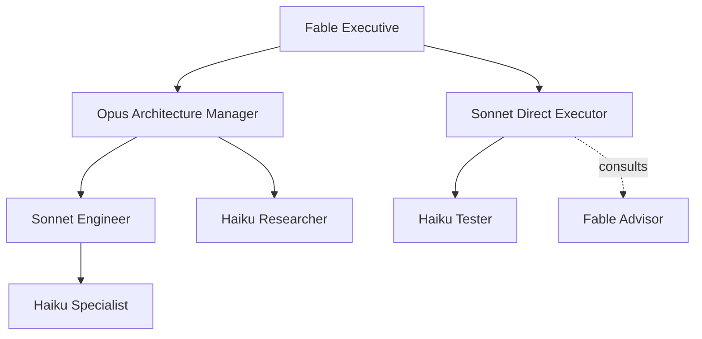

# Adaptive orchestration

Adaptive orchestration extends the existing subagent engine with bounded recursive
delegation and focused advisor consultation. Agnostic AI owns the execution graph;
Claude Code, Codex, hosted APIs, and local endpoints remain interchangeable model
transports through `LLMClient`.

## Three composable patterns

- **Hierarchy** transfers a bounded objective to a child that owns its result and may
  delegate again when its role permits it, including bounded parallel siblings through
  `delegate_parallel`.
- **Advisor** asks a focused question without transferring ownership. Advisors are
  read-only, receive only the supplied evidence, and cannot delegate.
- **Swarm** gathers independent perspectives concurrently. `/swarm` now runs through
  the same limits, cancellation signal, client isolation, and execution graph.

Delegation is useful for independent workstreams, parallel investigations,
specialization, or context isolation. A direct edit, simple lookup, or sequential
debugging step should stay with the current agent. `route_task` exposes the configured
heuristic decision and its reason; the model chooses a route, while code enforces every
hard boundary.

## Default organization

The following table is generated from `agent/orchestration/config.py`. Claude names are
default model targets, not provider restrictions. Subagents run on monthly subscriptions
or local endpoints, never on a metered API key: every default target is the Claude login
(`sub-claude-code`) with the role's model, falling back to the Codex login
(`sub-openai-codex`) with its default model. A `preset`/`provider` shorthand override that
does not list its own `fallbacks` ends in `{"inherit": true}`, so the child falls back
visibly to the parent model; an explicit `fallbacks` list (even an empty one) is honoured
exactly as written. A target that resolves to a metered API provider is reported as
unavailable unless the project sets `"allow_api_models": true`.

Subscription CLIs are launched without the vendor's API-key variables
(`ANTHROPIC_API_KEY`, `OPENAI_API_KEY`, `GEMINI_API_KEY`) so they bill the logged-in
account, and the harness model names are translated to the CLI's aliases
(`claude-haiku-4.5` becomes `haiku`); an unknown id would make Claude Code log
`unrecognized_model` and silently run its default model.

<!-- BEGIN GENERATED ROLE TABLE -->
| Role | Preferred model target | Delegates to | Advisors | Permissions |
|---|---|---|---|---|
| `executive` | `claude-fable-5` | manager, architecture-manager, security-manager, product-manager, verification-manager, engineer, specialist, researcher, reviewer, tester | none | read, search, network, shell, orchestrate, advisor |
| `manager` | `claude-opus-5` | engineer, specialist, researcher, reviewer, tester | executive | read, search, network, shell, orchestrate, advisor |
| `engineer` | `claude-sonnet-5` | specialist, researcher, reviewer, tester | manager, executive | read, search, network, shell, write, edit, orchestrate, advisor |
| `specialist` | `claude-haiku-4.5` | none | engineer, manager, executive | read, search |
| `researcher` | `claude-haiku-4.5` | none | engineer, manager, executive | read, search |
| `reviewer` | `claude-haiku-4.5` | none | engineer, manager, executive | read, search |
| `tester` | `claude-haiku-4.5` | none | engineer, manager, executive | read, search, shell |
| `architecture-manager` | `claude-opus-5` | engineer, specialist, researcher, reviewer, tester | executive | read, search, network, shell, orchestrate, advisor |
| `security-manager` | `claude-opus-5` | engineer, specialist, researcher, reviewer, tester | executive | read, search, network, shell, orchestrate, advisor |
| `product-manager` | `claude-opus-5` | engineer, specialist, researcher, reviewer, tester | executive | read, search, network, shell, orchestrate, advisor |
| `verification-manager` | `claude-opus-5` | engineer, specialist, researcher, reviewer, tester | executive | read, search, network, shell, orchestrate, advisor |
<!-- END GENERATED ROLE TABLE -->

Direct edges are intentional. In particular, `executive -> engineer`, `executive ->
specialist`, and `manager -> specialist` do not require an intermediate role.

## Delegate-first on an expensive model

When the interactive model is expensive (`expensive_models`, default Fable), the loop
turns orchestration on in `hierarchy` mode at the start of the next turn, including after
a `/model` switch, and the system prompt tells the root to delegate every research,
search, implementation, test run, and review to child roles and keep only decisions,
synthesis, and the final answer. `route_task` delegates at any complexity in that state.
Expensive-model agents are capped per operation (`limits.max_expensive_agents`, default
3) and a role whose primary target is expensive is refused inside `delegate_parallel`.
`/org status` shows `delegate-first` while this applies.



## The same graph in Claude Code

The roles above have a direct counterpart in the Claude Code harness, so a session run
there obeys the same shape without the Python runtime. The executive is the Fable main
loop under `fable-delegate-guard`, which keeps it on decisions, review and synthesis.
Managers are Opus subagents. Engineers are Sonnet subagents. Specialists, researchers,
reviewers and testers are Haiku subagents. Advisor edges are one shared agent
definition, `advisor` (Fable, read-only, Read/Grep/Glob only), installed into
`~/.claude/agents/` by first-run.

The edges are Fable to Opus, Sonnet, Haiku; Opus to Sonnet, Haiku; Sonnet to Haiku;
Haiku to nobody. Delegation only flows downward and peers are not edges, exactly as in
the role table. `capability-graph-guard` (`engine/hooks`) enforces that on every
Agent, Task and Workflow call, and caps advisor consultations at 2 per agent and 3 per
session so they stay inside the operator's own Fable spawn cap. Kill switches are
`CAPABILITY_GRAPH_GUARD=off` for the graph and `FABLE_DELEGATE_GUARD=off` for
delegate-first.

## Runtime contract

Each delegated agent gets a new `LLMClient`, fresh message list, structured task packet,
role-scoped tool registry, shared root cancellation event, and explicit workspace lease.
Only the distilled result returns to its parent. Nodes record parent/root IDs, role,
provider/model/effort, depth, status, timing, permissions, workspace owner, fallback
reason, children, and advisor calls. Edges distinguish `delegation` from `advisor`.

The runtime rejects unknown roles, unauthorized edges, delegation cycles, excessive
depth/fanout/concurrency/agent or advisor counts, and model-call budget exhaustion before
spawning more work. Limits bound one operation: they reset at the start of every turn and
of every out-of-turn `/research`, `/review`, or `/swarm`, so a long session never runs out
of subagents. Tool calls still pass through `ToolRegistry.execute`, the shared secret and
DashClaw lifecycle hooks, confirmation callback, and current trust tier. Hard-stop
confirmations are serialized: one human answer approves exactly one command, even when
parallel children ask at once. Parent permissions never flow into a child; the child's
role is the source of truth. The root agent keeps the interactive session's full
registry; its role row in the graph is descriptive.

Permissions map to tools in code (`PERMISSION_TO_TOOLS`): `read`, `search` (grep and
file search only), `network` (`read_url_content`, `search_web`; http(s) only, never
`file://`), `shell`, `write`, `edit`, `orchestrate`, `advisor`. Read-only roles have no
network egress by default.

A child whose model target is a subscription CLI is confined the same way: the CLI runs
in the child's workspace with its native tools disabled (`claude -p --tools ""`,
`codex exec -C <workspace> --sandbox read-only`), so the only tools it can use are the
JSON tool blocks that cross `ToolRegistry.execute`. `agy` exposes no tool-disable flag,
so it is never used for a child; the router records that and moves to the next target.

Read-only agents share the parent's workspace without owning it. Mutating parallel
siblings require isolated `branch` workspaces unless `allow_shared_mutation` is explicitly
enabled. A mutating child that asked for `branch` fails closed when no worktree can be
created; a read-only child inherits the parent workspace and says so in its report.
Worktrees live outside the repository (under the system temp directory, one folder per
repo) so an inherit-mode sibling can never write into them. A branch child of a branch
parent forks the parent's checkout: commits the parent made in its worktree are visible,
uncommitted edits are not. A branch worker's diff is saved under
`.agnostic/orchestration/patches/<agent-id>.diff` before its owned worktree is removed,
on success, failure, and cancellation alike; the parent reviews and applies that
artifact. A child cannot remove a parent or sibling lease. `/org prune` sweeps worktrees
no live lease owns and prints how many it removed.

Cancellation is cooperative across the tree. It is checked before model calls, child
creation, tools, and provider retries; shell commands and subscription CLI processes
receive the same event. Completed and failed nodes remain in the graph for `/org tree`,
headless JSON output, and the web companion. Graph details carry the exception type and a
bounded first line, never a provider transcript, and workspaces are shown relative to the
repository.

## Project configuration

Create `.agnostic/orchestration.json` only when the built-in defaults need changing. The
file is optional and stdlib JSON. Preset keys and model aliases are resolved through
`LLMConfig`; provider-specific credentials and subscription bridges remain outside the
orchestration layer.

```json
{
  "enabled": true,
  "mode": "auto",
  "root_role": "executive",
  "limits": {
    "max_depth": 3,
    "max_children_per_agent": 8,
    "max_parallel_children": 4,
    "max_total_agents": 32,
    "max_concurrent_agents": 12,
    "max_advisor_calls_per_agent": 4,
    "max_model_calls": 100
  },
  "roles": {
    "executive": {
      "preset": "sub-openai-codex",
      "model": "gpt-5.6-sol",
      "effort": "high",
      "fallbacks": [
        {"preset": "sub-claude-code", "model": "claude-opus-5"},
        {"inherit": true}
      ]
    },
    "engineer": {
      "preset": "sub-claude-code",
      "model": "claude-sonnet-5",
      "allowed_children": ["specialist", "researcher", "tester"]
    },
    "specialist": {
      "preset": "local-lmstudio",
      "model": "qwen-coder-local",
      "permissions": ["read", "search", "shell"]
    },
    "gpu-reviewer": {
      "base": "reviewer",
      "provider": "local",
      "model": "qwen3-coder",
      "base_url": "http://gpu-box:8000/v1"
    },
    "codex-engineer": {
      "base": "engineer",
      "preset": "sub-openai-codex",
      "model": "gpt-5.6-terra",
      "effort": "high"
    }
  }
}
```

Role overrides may use `base`, `description`, `instructions`,
`additional_instructions`, `permissions`, `additional_permissions`,
`allowed_children`, `allowed_advisors`, `workspace`, `models`, or the shorthand
`preset` / `provider` / `model` / `effort` / `base_url` / `api_key_env` / `fallbacks`
(not both `models` and the shorthand). A model target is a preset, an explicit provider
plus model, or `{ "inherit": true }`. A self-hosted endpoint is `provider: local` plus a
`base_url` (keyless). A metered provider, with or without `api_key_env`, is only usable
when `allow_api_models` is true. `expensive_models` (default `["claude-fable-5",
"fable"]`) names the models that trigger delegate-first.

`mode` accepts `auto`, `hierarchy`, or `advisor`. Modes change prompt and heuristic
threshold emphasis; they never relax capability or safety policy. Invalid or cyclic configuration
fails closed: orchestration is disabled and the UI reports the error while flat
`invoke_subagent` remains available.

## Commands and provider-native features

`/org on`, `/org off`, `/org status`, `/org tree`, `/org config`, `/org prune`, and
`/org mode ...` work in both interactive shells; `on`, `off`, and `mode` wait for a running
turn to finish. Headless `agnostic -p` reads the project configuration at construction
and includes the graph in JSON output; a malformed file is reported as a notice and
orchestration stays off, the turn itself is unaffected.

Claude Code supports fresh-context custom agents, model/tool restrictions, nested agents,
background execution, and worktree isolation. Codex supports configurable parallel
subagents and per-agent model/reasoning settings. Agnostic uses those CLIs as model
transports today rather than outsourcing its graph, because provider-native semantics and
recursive support differ. See the official [Claude Code subagent documentation](https://code.claude.com/docs/en/sub-agents)
and [Codex subagent documentation](https://learn.chatgpt.com/docs/agent-configuration/subagents).
