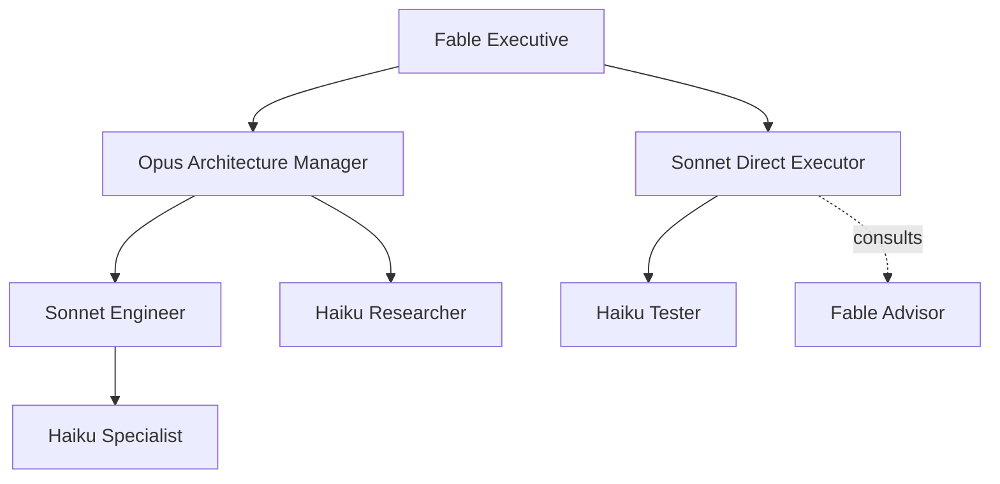

# Adaptive orchestration

Adaptive orchestration extends the existing subagent engine with bounded recursive
delegation and focused advisor consultation. Agnostic AI owns the execution graph;
Claude Code, Codex, hosted APIs, and local endpoints remain interchangeable model
transports through `LLMClient`.

## Three composable patterns

- **Hierarchy** transfers a bounded objective to a child that owns its result and may
  delegate again when its role permits it, including bounded parallel siblings through
  `delegate_parallel`.
- **Advisor** asks a focused question without transferring ownership. Advisors are
  read-only, receive only the supplied evidence, and cannot delegate.
- **Swarm** gathers independent perspectives concurrently. `/swarm` now runs through
  the same limits, cancellation signal, client isolation, and execution graph.

Delegation is useful for independent workstreams, parallel investigations,
specialization, or context isolation. A direct edit, simple lookup, or sequential
debugging step should stay with the current agent. `route_task` exposes the configured
heuristic decision and its reason; the model chooses a route, while code enforces every
hard boundary.

## Default organization

The following table is generated from `agent/orchestration/config.py`. Claude names are
default model targets, not provider restrictions. Every target falls back visibly to an
independent client using the parent model when the preferred subscription is unavailable.

<!-- BEGIN GENERATED ROLE TABLE -->
| Role | Preferred model target | Delegates to | Advisors | Permissions |
|---|---|---|---|---|
| `executive` | `claude-fable-5` | manager, architecture-manager, security-manager, product-manager, verification-manager, engineer, specialist, researcher, reviewer, tester | none | read, search, shell, orchestrate, advisor |
| `manager` | `claude-opus-5` | engineer, specialist, researcher, reviewer, tester | executive | read, search, shell, tests, orchestrate, advisor |
| `engineer` | `claude-sonnet-5` | specialist, researcher, reviewer, tester | manager, executive | read, search, shell, tests, write, edit, orchestrate, advisor |
| `specialist` | `claude-haiku-4.5` | none | engineer, manager, executive | read, search |
| `researcher` | `claude-haiku-4.5` | none | engineer, manager, executive | read, search |
| `reviewer` | `claude-haiku-4.5` | none | engineer, manager, executive | read, search |
| `tester` | `claude-haiku-4.5` | none | engineer, manager, executive | read, search, shell, tests |
| `architecture-manager` | `claude-opus-5` | engineer, specialist, researcher, reviewer, tester | executive | read, search, shell, tests, orchestrate, advisor |
| `security-manager` | `claude-opus-5` | engineer, specialist, researcher, reviewer, tester | executive | read, search, shell, tests, orchestrate, advisor |
| `product-manager` | `claude-opus-5` | engineer, specialist, researcher, reviewer, tester | executive | read, search, shell, tests, orchestrate, advisor |
| `verification-manager` | `claude-opus-5` | engineer, specialist, researcher, reviewer, tester | executive | read, search, shell, tests, orchestrate, advisor |
<!-- END GENERATED ROLE TABLE -->

Direct edges are intentional. In particular, `executive -> engineer`, `executive ->
specialist`, and `manager -> specialist` do not require an intermediate role.



## Runtime contract

Each delegated agent gets a new `LLMClient`, fresh message list, structured task packet,
role-scoped tool registry, shared root cancellation event, and explicit workspace lease.
Only the distilled result returns to its parent. Nodes record parent/root IDs, role,
provider/model/effort, depth, status, timing, permissions, workspace owner, fallback
reason, children, and advisor calls. Edges distinguish `delegation` from `advisor`.

The runtime rejects unknown roles, unauthorized edges, delegation cycles, excessive
depth/fanout/concurrency/agent or advisor counts, and model-call budget exhaustion before
spawning more work. Tool calls still pass through `ToolRegistry.execute`, the shared
secret and DashClaw lifecycle hooks, confirmation callback, and current trust tier.
Parent permissions never flow into a child; the child's role is the source of truth.

Read-only agents share the parent's workspace without owning it. Mutating parallel
siblings require isolated `branch` workspaces unless `allow_shared_mutation` is explicitly
enabled. A branch worker's diff is saved under
`.agnostic/orchestration/patches/<agent-id>.diff` before its owned worktree is removed;
the parent reviews and applies that artifact. A child cannot remove a parent or sibling
lease.

Cancellation is cooperative across the tree. It is checked before model calls, child
creation, and tools; shell commands and subscription CLI processes receive the same event.
Completed and failed nodes remain in the graph for `/org tree`, headless JSON output, and
the web companion.

## Project configuration

Create `.agnostic/orchestration.json` only when the built-in defaults need changing. The
file is optional and stdlib JSON. Preset keys and model aliases are resolved through
`LLMConfig`; provider-specific credentials and subscription bridges remain outside the
orchestration layer.

```json
{
  "enabled": true,
  "mode": "auto",
  "root_role": "executive",
  "limits": {
    "max_depth": 3,
    "max_children_per_agent": 8,
    "max_parallel_children": 4,
    "max_total_agents": 32,
    "max_concurrent_agents": 12,
    "max_advisor_calls_per_agent": 4,
    "max_model_calls": 100
  },
  "roles": {
    "executive": {
      "preset": "sub-openai-codex",
      "model": "gpt-5.6-sol",
      "effort": "high",
      "fallbacks": [
        {"preset": "sub-claude-code", "model": "claude-opus-5"},
        {"inherit": true}
      ]
    },
    "engineer": {
      "preset": "sub-claude-code",
      "model": "claude-sonnet-5",
      "allowed_children": ["specialist", "researcher", "tester"]
    },
    "specialist": {
      "preset": "local-lmstudio",
      "model": "qwen-coder-local",
      "permissions": ["read", "search", "tests"]
    },
    "codex-engineer": {
      "base": "engineer",
      "preset": "sub-openai-codex",
      "model": "gpt-5.6-terra",
      "effort": "high"
    }
  }
}
```

Role overrides may use `base`, `description`, `instructions`,
`additional_instructions`, `permissions`, `additional_permissions`,
`allowed_children`, `allowed_advisors`, `workspace`, `models`, or the shorthand
`preset` / `provider` / `model` / `effort` / `fallbacks`. A model target is a preset,
an explicit provider plus model, or `{ "inherit": true }`.

`mode` accepts `auto`, `hierarchy`, or `advisor`. Modes change prompt and heuristic
threshold emphasis; they never relax capability or safety policy. Invalid or cyclic configuration
fails closed: orchestration is disabled and the UI reports the error while flat
`invoke_subagent` remains available.

## Commands and provider-native features

`/org on`, `/org off`, `/org status`, `/org tree`, `/org config`, and `/org mode ...`
work in both interactive shells. Headless `agnostic -p` reads the project configuration
at construction and includes the graph in JSON output.

Claude Code supports fresh-context custom agents, model/tool restrictions, nested agents,
background execution, and worktree isolation. Codex supports configurable parallel
subagents and per-agent model/reasoning settings. Agnostic uses those CLIs as model
transports today rather than outsourcing its graph, because provider-native semantics and
recursive support differ. See the official [Claude Code subagent documentation](https://code.claude.com/docs/en/sub-agents)
and [Codex subagent documentation](https://learn.chatgpt.com/docs/agent-configuration/subagents).
